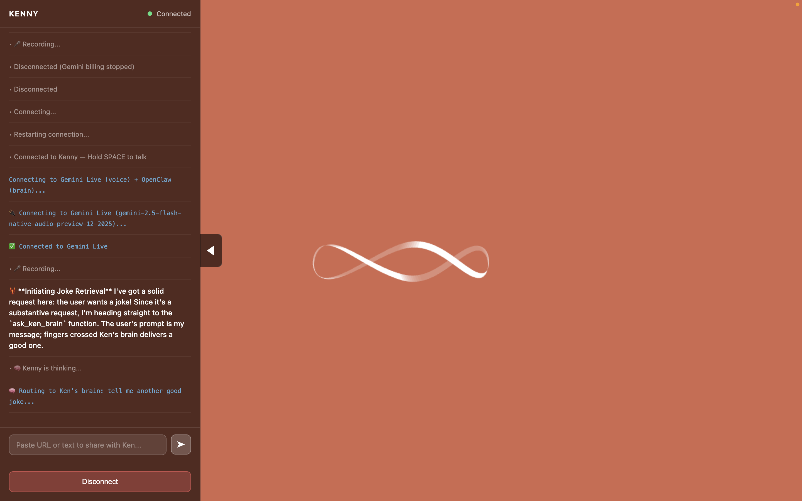

# Her Voice UI

A "Her"-style voice interface powered by Google's Gemini Live API. Real-time voice conversations with a beautiful, minimal UI inspired by the movie "Her".




## Features

- **Real-time voice conversations** - Full-duplex audio streaming with Gemini's native audio model
- **Push-to-talk** - Hold SPACE to talk, release to listen
- **Beautiful waveform visualization** - Reactive audio visualization in the Her OS1 style
- **Thinking animation** - Elegant infinity loop animation when the AI is processing
- **Interrupt support** - Press SPACE while the AI is speaking to interrupt
- **Debug drawer** - Server logs and connection status visible in a slide-out panel
- **Share URLs/text** - Paste content to discuss with the AI

## Quick Start

### Prerequisites

- Python 3.10+
- Node.js (for serving static files)
- A [Google AI Studio](https://aistudio.google.com/) API key with Gemini Live access

### 1. Clone and Setup

```bash
git clone https://github.com/LizMyers/her-voice-ui.git
cd her-voice-ui
```

### 2. Configure API Key & Voice

```bash
cd server
cp .env.example .env
# Edit .env and add your GEMINI_API_KEY
```

In your `.env` file, you can also choose a voice:

```bash
GEMINI_API_KEY=your-api-key-here
GEMINI_VOICE=Kore  # Options: Aoede, Charon, Fenrir, Kore, Puck
```

Each voice has a distinct personality - try them out to find your favorite!

### 3. Install Dependencies

```bash
cd server
python -m venv venv
source venv/bin/activate  # On Windows: venv\Scripts\activate
pip install -r requirements.txt
```

### 4. Start the Server

```bash
cd server
source venv/bin/activate
source .env  # Or set GEMINI_API_KEY environment variable
python main.py
```

### 5. Serve the Frontend

In a new terminal:

```bash
cd her-voice-ui
npx serve . -l 3000
```

### 6. Open in Browser

Navigate to `http://localhost:3000` and click anywhere to start.

**Controls:**
- **Hold SPACE** - Talk to the AI
- **Release SPACE** - Listen to response
- **Press SPACE while AI speaks** - Interrupt
- **ESC** - Toggle debug drawer

## Architecture

```
Browser                    Server                     Gemini
┌─────────────┐           ┌─────────────┐           ┌─────────────┐
│ Microphone  │──audio──▶ │  WebSocket  │──audio──▶ │ Gemini Live │
│             │           │   Server    │           │  (STT+LLM)  │
│ Speaker +   │◀──audio── │  (FastAPI)  │◀──audio── │  +TTS       │
│ Visualizer  │           │             │           │             │
└─────────────┘           └─────────────┘           └─────────────┘
```

**Frontend:** Vanilla JavaScript with WebSocket audio streaming
**Backend:** FastAPI WebSocket server proxying to Gemini Live
**AI:** Gemini 2.5 Flash with native audio dialog capabilities

## SDK Optimizations

This implementation includes several optimizations for smooth voice conversations:

### 1. Audio Buffering & Crossfade
Audio chunks are accumulated into ~1-second buffers before playback. Chunks are crossfaded with 50ms overlap to eliminate clicking/popping between segments.

```javascript
// Crossfade scheduling
gainNode.gain.setValueAtTime(0, startTime);
gainNode.gain.linearRampToValueAtTime(1, startTime + fadeTime);
```

### 2. Low-Pass Filtering
A low-pass filter at 8kHz reduces high-frequency artifacts from resampling (Gemini outputs 24kHz PCM).

```javascript
this.lowPassFilter = ctx.createBiquadFilter();
this.lowPassFilter.type = 'lowpass';
this.lowPassFilter.frequency.value = 8000;
```

### 3. Smart Audio Queue Completion
Instead of a fixed timeout, the frontend tracks the actual scheduled audio end time to know when the AI has finished speaking:

```javascript
const scheduledEnd = this.visualizer?.nextChunkTime || 0;
const now = ctx?.currentTime || 0;
if (scheduledEnd > now + 0.5) {
    // Still playing...
}
```

### 4. Thinking State Animation
A preloaded CodePen embed provides the "thinking" animation without layout shift. Uses CSS `opacity` + `pointer-events` instead of `display` to avoid flash:

```css
#thinking-container {
    opacity: 0;
    pointer-events: none;
    transition: opacity 0.3s ease;
}
```

### 5. Push-to-Talk with Interrupt
When SPACE is pressed while audio is playing, the queue is cleared and the connection sends a silence buffer to signal turn completion:

```javascript
interruptPlayback() {
    this.audioQueue = [];
    this.visualizer.analyser.disconnect();
}
```

### 6. Server-Side Audio Buffering
The backend accumulates ~48KB of audio (~1 second) before sending to reduce WebSocket message overhead and chunk boundaries:

```python
BUFFER_TARGET_SIZE = 48000  # ~1 second at 24kHz 16-bit mono
if len(audio_buffer) >= BUFFER_TARGET_SIZE:
    wav_data = pcm_to_wav(bytes(audio_buffer))
    await websocket.send_text(json.dumps({...}))
```

## Customization

### System Prompt
Edit `server/gemini_client.py` to customize the AI's personality:

```python
DEFAULT_SYSTEM_PROMPT = """You are a helpful, friendly AI assistant..."""
```

### Voice Selection
Available voices: `Aoede`, `Charon`, `Fenrir`, `Kore`, `Puck`

Set in your `.env` file:
```bash
GEMINI_VOICE=Kore
```

No code changes needed - just update `.env` and restart the server.

### Colors
Edit `src/styles.css` to change the background color:

```css
body {
    background: #d1684e;  /* Her OS1 coral/salmon */
}
```

## Project Structure

```
her-voice-ui/
├── public/
│   └── index.html          # Main HTML page
├── server/
│   ├── main.py             # FastAPI WebSocket server
│   ├── gemini_client.py    # Gemini Live API integration
│   ├── requirements.txt    # Python dependencies
│   └── .env                # API key (create from .env.example)
└── src/
    ├── app.js              # Main frontend application
    ├── audio-visualizer.js # Waveform visualization
    ├── thinking-animation.js # Thinking state animation
    ├── websocket-client.js # WebSocket connection handling
    └── styles.css          # Her-inspired styling
```

## Troubleshooting

### "GEMINI_API_KEY not configured"
Make sure you've created `server/.env` with your API key:
```
GEMINI_API_KEY=your_key_here
```

### Audio crackling or distortion
Try adjusting the low-pass filter frequency in `audio-visualizer.js`:
```javascript
this.lowPassFilter.frequency.value = 6000;  // Lower = smoother
```

### WebSocket connection fails
Ensure the server is running on port 8765 and no firewall is blocking it.

### Microphone not working
Grant microphone permissions when prompted. The browser requires HTTPS or localhost.

## Credits

- **Created by:** [Liz Myers](https://github.com/LizMyers) & [Claude Opus 4.5](https://claude.ai) (Anthropic)
- **Thinking Animation:** Based on the beautiful [Her OS1 CodePen](https://codepen.io/psyonline/pen/yayYWg) by [Siyoung Park (@psyonline)](https://codepen.io/psyonline)
- **Design Inspiration:** The movie "Her" (2013) by Spike Jonze
- **Voice AI:** [Google Gemini Live API](https://ai.google.dev/)

## License

MIT License - see [LICENSE](LICENSE) for details.

---

Built with love by Liz Myers & Claude Opus 4.5, inspired by Her.
